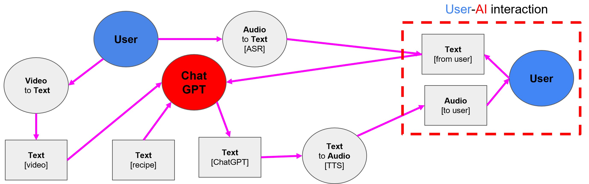

# MISAR: A Multimodal Instructional System with Augmented Reality 🌐


*Consider adding a logo or relevant image to make it visually appealing.*

Welcome to the official repository of MISAR! This repository contains the data and demo associated with our paper, accepted for publication at **ICCV 2023**.

## 📖 Abstract
Augmented reality (AR) presents us with a world where the boundaries between the real and the digital blur. But to make this seamless, there's a need to effectively merge various input channels such as visual, auditory, and linguistic for an optimized human-computer interaction. While we've made strides in auditory and visual domains, the huge potential of large language models (LLMs) in AR is still waiting to be fully unlocked. 

MISAR is our attempt to bridge this gap. We introduce an avant-garde methodology that leverages the power of LLMs to interpret and process information from visual, auditory, and contextual dimensions. Our focus has been on addressing the challenge of task performance measurement in AR. This led us to the incorporation of egocentric video analytics, nuanced speech processing, and meticulous context examination. By integrating LLMs, we've managed to considerably elevate state estimation, pushing the boundaries of what AR systems can achieve in terms of adaptiveness.

[**🎥 Check out our System Demo!**](https://drive.google.com/file/d/1X09IJBmqgtif3Bts8WHOw4bE3OklYoaX/view?usp=sharing)


## Citation
https://arxiv.org/pdf/??.pdf
```
@article{bi2023misar,
  title={MISAR: A Multimodal Instructional System with Augmented Reality},
  author={Bi, Jing and Nguyen, Nguyen and Vosoughi, Ali and Xu, Chenliang},
  journal={ICCV},
  year={2023}
}
```

## 📜 License
This project is licensed under the The MIT License (MIT).

## 🙌 Acknowledgments
* Approved for public release; distribution is unlimited. This work has been supported by the Defense Advance Research Projects Agency (DARPA) under Contract HR00112220003. The content of the information does not necessarily reflect the position of the Government, and no official endorsement should be inferred.

---

**🔗 Stay connected**: Follow our progress, join discussions, or drop your suggestions [here](link_to_forum_or_community_page).

---

**For any queries, feel free to raise an issue or contact us directly via [email](your_email_address).**

